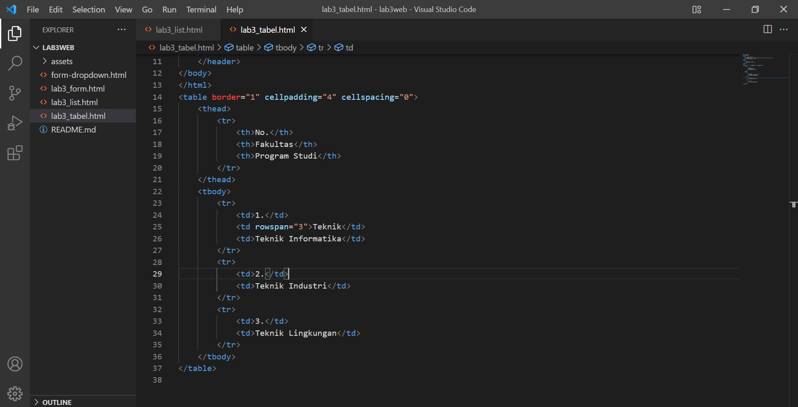
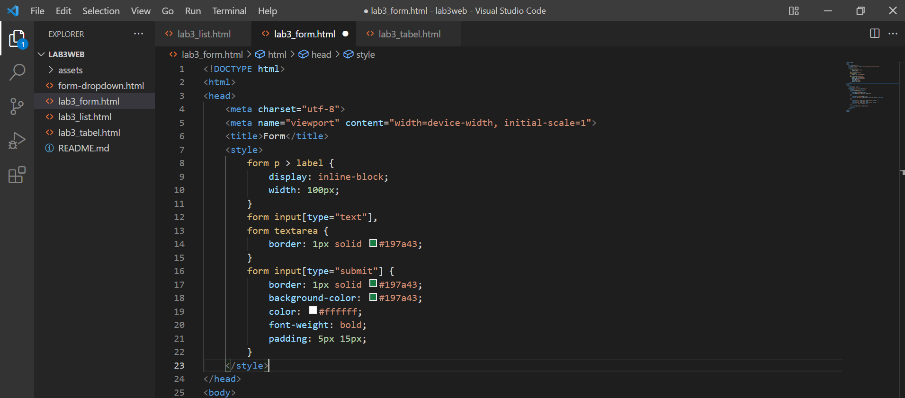

| Nama      | Firman Lintar Nurrohman |
| ----------- | ----------- |
| NIM     | 312010197       |
| Kelas   | TI.20.A.1        |

## Langkah langkah praktikum 3
Membuka text editor, Saya menggunakan Sublime text

## 1. Membuat Ordered List
tambahkan kode untuk membuat Ordered List seperti berikut.

Output

## 2. Membuat Unordered list
Kemudian tambakan kode untuk membuat Unordered List, setelah deklarasi ordered list pada
section unordered-list, seperti berikut.

Output

## 3. Membuat Description List
Kemudian tambahkan kode untuk membuat description list setelah deklarasi unorderd-list.

Output

## 4. Membuat Tabel
Buat file baru dengan nama lab3_tabel.html, Kemudian tambahkan kode untuk membuat tabel sederhana seperti berikut:

Output

## 5. Mengatur Margin & Padding
Untuk mengatur margin dan padding pada cel data, tambahkan atribut cellpadding dan cellspacing pada tag table.

Output

## 6. Menggabungkan Sel Data
Untuk menggabungkan sel data, gunakan atribut rowspan dan colspan. Atribut rowspan untuk menggabungkan baris (secara vertikal) dan colspan untuk menggabungkan kolom (secara horizontal).

Output

## 7. Membuat Form
Buat file baru dengan nama lab3_form.html, Kemudian tambahkan kode untuk membuat tabel sederhana seperti berikut:

Output

## 8. Menambahkan style pada Form
Agar tampilan form lebih menarik, bisa ditambahkan CSS seperti berikut.

Output

## Pertanyaan dan Tugas
1. Buatlah form yang menampilkan dropdown menu dan listbox dengan multiple selection.

## Jawab
1. HTML

	

	CSS

	

	Output

	
